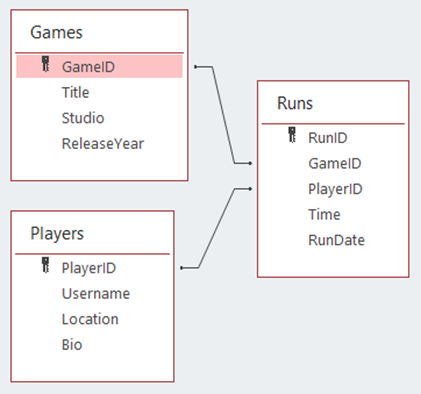
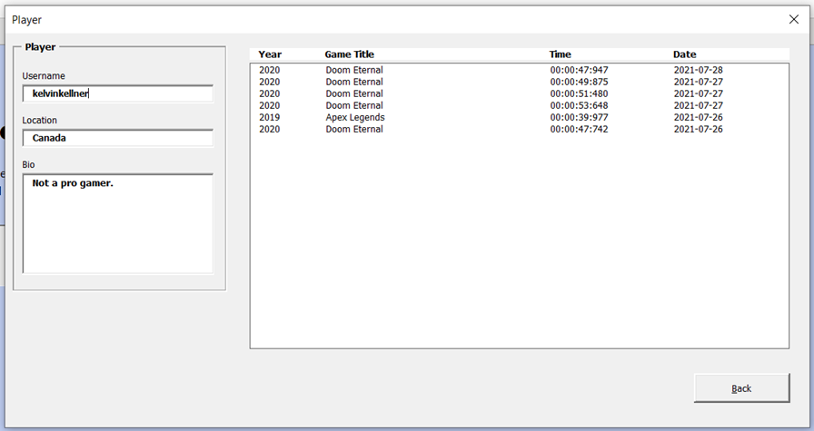
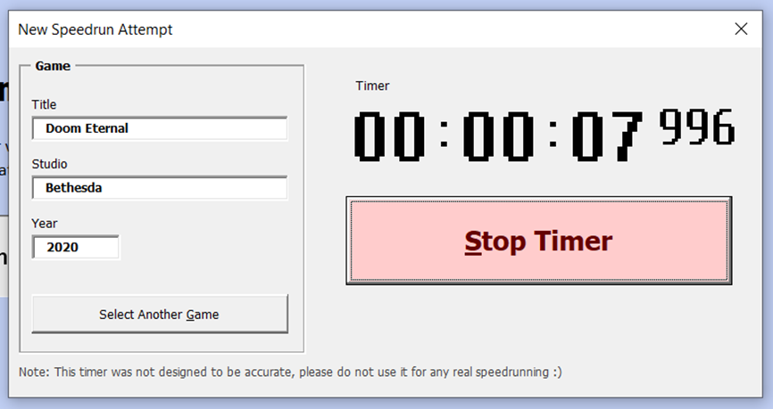
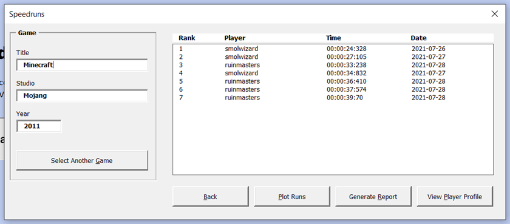
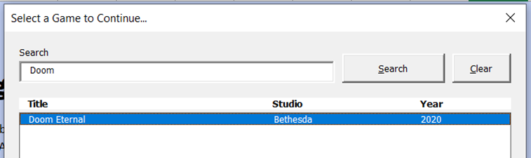
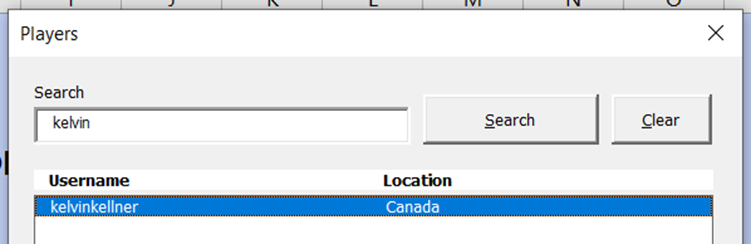
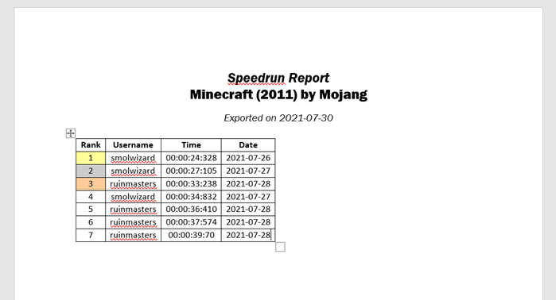
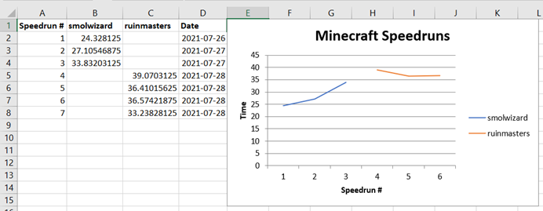

# Fictional Speedrunning Community

## Description

This program is an implementation of a Speedrunning Community to the likes of [speedrun.com](https://www.speedrun.com/). After simulating an account registration process, users can navigate the application where they can view speedrun records made by other users, attempt their own speedruns using the built-in timer, visit other player’s profiles, or edit their own public player profile. The application also allows users to generate a speedrun report for all games or their favourite game to a Word document, or they can generate a chart in Excel which will display the runs made by users for a particular game over time.

The program is started by pressing the button in the Main sheet of [_a5_kell8940.xlsm_](https://github.com/kelvinkellner/Fictional-Speedrunning-Community/blob/main/a5_kell8940.xlsm). It is powered by a series Userforms which prompt actions from the user. All features are implemented in VBA. All data is stored and received from the [_speedrunning.accdb_](https://github.com/kelvinkellner/Fictional-Speedrunning-Community/blob/main/speedrunning.accdb) file which must be included in the same directory as the application.

## Features

- Log In, Sign In, and Log Out of Player accounts
- Search for and view other Player’s profiles to see their username, location, bio, and runs
- View and edit their own Player profile
- Search for, view, edit, and add Games to the Games list
- View speedrun attempts for any Game in the Game list
- Time new speedrun attempts using built-in timer, add their records to the list of runs if desired
- Generate a Word document report featuring a table of runs for any Game, or all Games
- Plot a Excel chart featuring run times per player in chronological order

## Motivation

I enjoy playing video games with my friends and I also spend a lot of time watching YouTube videos. Unsurprisingly there is a lot of intersection between these two hobbies. I already knew about speedrunning in Minecraft thanks to my friends (we play a lot of Bed Wars together), but when watching YouTube one day I heard about speedrunning for classic Doom games, and eventually found and watched a [30 minute video discussing speedruns for Doom Eternal](https://www.youtube.com/watch?v=N9LXQSzumlg) and I was immediately hooked: the game seemed fantastic, requiring an immense amount of focus, skill, and determination to achieve new records. I bought the game as soon it went on sale and have deeply enjoyed playing it.

Now, I was simply sitting at my desk pondering about ideas for applications that could be implemented using a few simple Access database tables. When the concept of a speedrunning community came to mind, I knew it was the perfect idea for me to build for this assignment!

The entirety of the Game is implemented in the Main Excel Workbook. There is a _Main_ module which simply shows the Log In or Sign Up prompt, from there, the actions of the user dictates the flow of the program. All other code is included in each of the various Userforms. The _frmMain_ Userform contains a few important global variables used by the other Userforms. The program is designed to be modular, meaning there are a few public Subs that are contained in one Userform but used by other Userforms.

Data is not stored in global Arrays, rather, each time the program needs dataset it makes an SQL Query to the database and pulls the information it needs to a record sheet.

The Access database relationships are pictured below:

Admittedly, some of the code used in this program is disorganized. In a perfect world, it would be preferred to go back and refactor various features of the app to improve readability and computer run time, however their only so much time and it is even more preferred to hand assignments in on time :)

Given the large scope of the program I decided to build I am not surprised I had to rush some portions, but all the features I was hoping to add are functioning and complete, and that’s what matters!

There is one known bug I simply do not have the time to fix right now. Sometimes, when _View Profile_ is clicked for a particular Player, the last Player that was viewed is shown instead of the current one. However, when the user pressed _Back_ and tries a second time everything works alright. I have an idea as to why this is happening but will not be fixing it before submitting this assignment. Too bad! Haha

## Contributors

- [Kelvin Kellner](https://github.com/kelvinkellner/)

## Pictures

**Figure 1:** Player Profile

**Figure 2:** New Speedrun attempt timer

**Figure 3:** Speedruns for a chosen Game

**Figure 4:** Search feature for Games and Players

**Figure 5:** Speedrun Report in Word

**Figure 6:** Speedruns Plotted in Excel for a Game

